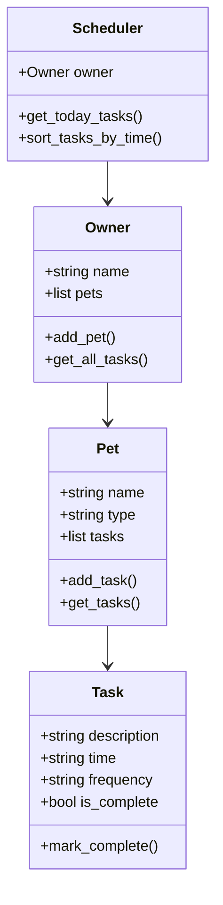

# PawPal+ Reflection

### System Design

The PawPal+ application is designed to help pet owners manage daily pet care tasks efficiently.

### Core User Actions

1. **Add and manage pets**
   Users can create and manage profiles for their pets, including basic information like name and type.

2. **Create and manage tasks**
   Users can assign tasks to pets such as feeding, walking, or vet visits, including time and frequency.

3. **View daily schedule**
   Users can view a list of tasks scheduled for the day across all pets in one place.

---

### Building Blocks

### Task

**Attributes:**

* description
* time
* frequency
* is_complete

**Methods:**

* mark_complete()

---

### Pet

**Attributes:**

* name
* type
* tasks (list of Task objects)

**Methods:**

* add_task()
* get_tasks()

---

### Owner

**Attributes:**

* name
* pets (list of Pet objects)

**Methods:**

* add_pet()
* get_all_tasks()

---

### Scheduler

**Attributes:**

* owner

**Methods:**

* get_today_tasks()
* sort_tasks_by_time()

---

### UML Diagram

---

### 1a. Initial Design

I designed the system using four main classes: Task, Pet, Owner, and Scheduler.

The Task class represents individual activities with attributes such as description, time, frequency, and completion status.

The Pet class represents each pet and contains a list of tasks associated with that pet.

The Owner class manages multiple pets and serves as the main access point for retrieving all tasks across pets.

The Scheduler class acts as the central component that gathers and organizes tasks from all pets to produce a daily schedule.

This design keeps responsibilities separated and makes the system easier to maintain and expand.

---

### 1b. Design Changes

After reviewing the design, I ensured that the Scheduler interacts only with the Owner instead of directly accessing individual pets. This improves modularity and keeps the system organized.

I also confirmed that tasks are stored within each Pet instead of globally, which better represents real-world behavior.

These adjustments improved clarity and made the system more scalable without adding unnecessary complexity.
